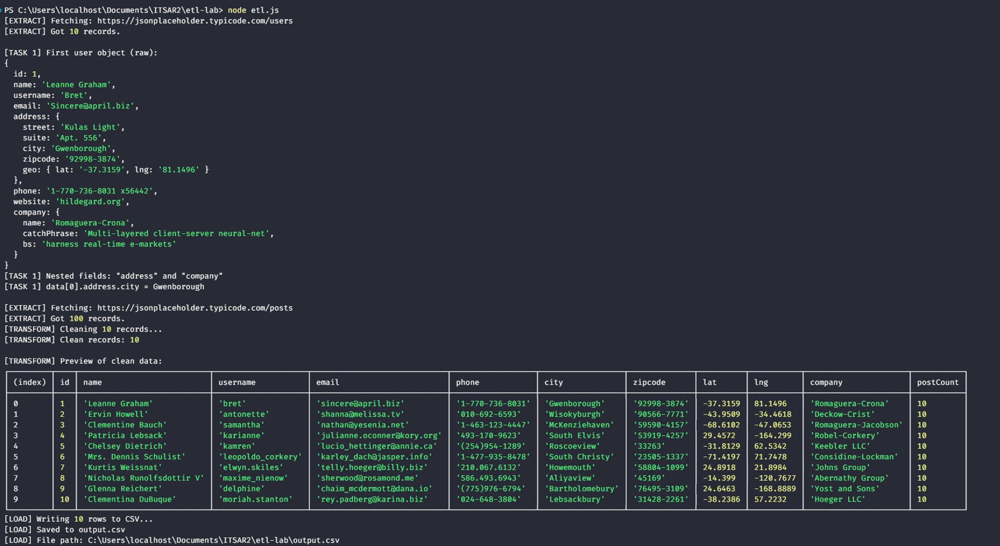
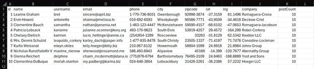

# Lab 1: Data Integration and ETL - Fetching Data from an API

## Project Overview
This project demonstrates a simple ETL (Extract, Transform, Load) pipeline using plain Node.js without any external frameworks or npm packages.

### ETL Stages:
1. **Extract:** Fetches user data from the [JSONPlaceholder API](https://jsonplaceholder.typicode.com/users) and post data from the [/posts](https://jsonplaceholder.typicode.com/posts) endpoint using the built-in `fetch()` function.
2. **Transform:**
   - Flattens nested JSON objects (address, geo, and company).
   - Cleans data by trimming whitespace and converting fields to lowercase.
   - Calculates a `postCount` for each user by joining with post data.
   - Filters out records with invalid emails.
3. **Load:** Formats the cleaned data as CSV and writes it to `output.csv` using the built-in `fs` module.

## Prerequisites
- **Node.js 18+**: Required for built-in `fetch` and modern JavaScript features.

## Usage
To execute the ETL pipeline, run the following command in your terminal:
```bash
node etl.js
```

## Lab Documentation
The following PDF contains the full lab requirements, tasks, and completed assessment details.

<p>You can <a href="src/docs/ITSAR2_LAB_1.pdf">download the PDF</a> to view it.</p>
---

## Lab Assessment: ITSAR2 LAB 1

**Course:** DATA INTEGRATION AND ETL  
**Year & Section:** BSIT – 3B

**Group Members:**
- Curio, Josh Nathan
- Gilera, Rowena
- Gromea, Nehje John
- Guanzon, Jurriel
- Sildora, Jegrick

### Task 1: Data Inspection
1. **What fields are nested objects (not plain values)?**
   - **Answer:** Nested fields: `address` and `company` (note: `address.geo` is nested inside `address`).
2. **What is the value of `data[0].address.city`?**
   - **Answer:** Value: `data[0].address.city = Gwenborough`

### Task 2: Data Transformation
1. **What does `.split(' ')[0]` do to the phone number?**
   - **Answer:** It keeps the substring before the first space — removes extensions (e.g., `x56442`) or extra text after the main phone number.
2. **Why do we use `parseFloat()` on `lat` and `lng`?**
   - **Answer:** To convert latitude/longitude from strings to numeric values for arithmetic, sorting, or filtering.
3. **The filter step removes records without '@' in the email. How many records passed the filter?**
   - **Answer:** Records passed filter: 10

### Task 3: Data Loading
1. **How many columns does the CSV have? List them.**
   - **Answer:** 11 columns — `id`, `name`, `username`, `email`, `phone`, `city`, `zipcode`, `lat`, `lng`, `company`, `postCount`.
2. **What is the company name of the user with `id = 5`?**
   - **Answer:** Company (id = 5): `Keebler LLC`
3. **What does `fs.writeFileSync()` do? What would happen if you used `fs.appendFileSync()` instead?**
   - **Answer:** `fs.writeFileSync()` synchronously writes the file and overwrites any existing file at that path. Using `fs.appendFileSync()` would append data to the end of the file, causing repeated runs to accumulate rows instead of replacing them.

---

## Challenge Summaries

### Challenge A: Fetching Additional Data
- **Implementation:** Fetched `/posts` endpoint, counted posts per `userId`, and added a `postCount` column to each user row.
- **Result:** Each user in the JSONPlaceholder dataset has a `postCount` of 10.

### Challenge B: Error Handling
- **Implementation:** Added a `.catch()` block to `main()` that prints a friendly error message (`[ERROR] ETL pipeline failed: <message>`) and exits with a non-zero status.
- **Behavior:** If the API is down or the URL is invalid, the `extract()` call throws an error, no CSV is written, and the failure is logged.

### Challenge C: Conditional Filtering
- **Implementation:** Added a filter after building the rows: `const southern = rows.filter(r => r.lat < 0);`.
- **Result:** 7 users remain in the Southern Hemisphere (IDs: 1, 2, 3, 5, 6, 8, 10).

---

## Visual Evidence

### Terminal Output


### MS Excel Output (output.csv)



